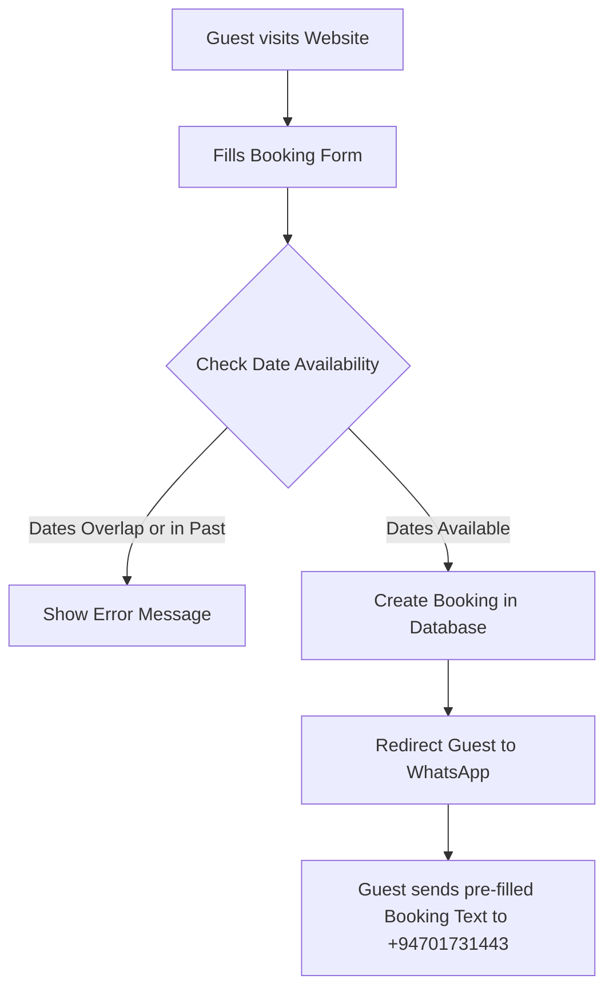

# 🏡 Eury Nature Cabana Nuwara Eliya
## Website Operations & Administration Guide
*A comprehensive guide for the system administrator and business owner.*

---

## 📋 Table of Contents
1. [System Overview & Live Links](#1-system-overview--live-links)
2. [Guest Booking & WhatsApp Workflow](#2-guest-booking--whatsapp-workflow)
3. [Admin Panel Guide](#3-admin-panel-guide)
4. [Content Management (Dining & Gallery)](#4-content-management-dining--gallery)
5. [Technical Architecture & Maintenance](#5-technical-architecture--maintenance)
6. [Website Keep-Alive (Cron Job Setup)](#6-website-keep-alive-cron-job-setup)

---

## 1. System Overview & Live Links

This website is a custom-built, full-stack web application designed for **Eury Nature Cabana Nuwara Eliya**. It includes a modern responsive frontend for guests to explore accommodations, view amenities, browse the dining menu, view the photo gallery, and make booking reservations. It also features a secure administrative dashboard for managing reservations, dining menu items, and gallery media.

### 🌐 Key Links & Credentials
*   **Public Website**: [https://www.eurynature.com.lk](https://www.eurynature.com.lk)
*   **Admin Dashboard**: [https://www.eurynature.com.lk/admin.html](https://www.eurynature.com.lk/admin.html)
*   **Admin Login Username**: `admin`
*   **Admin Login Password**: `euryadmin2024`
*   **Primary Admin WhatsApp Business Number**: `0701731443` (International: `+94701731443`)

---

## 2. Guest Booking & WhatsApp Workflow

The booking process is integrated with WhatsApp to ensure instant, reliable communication between the guest and the administration without requiring expensive SMS gateways.

### 🔄 Step-by-Step Guest Flow


1.  **Date Selection & Validation**:
    *   Guests select their dates and cabana type (e.g., Main Cabana or Little Eury).
    *   The website validates that check-in dates are not in the past.
    *   **Double-Booking Prevention**: The system checks the database in real-time. If there is already a booking (pending or confirmed) that overlaps with the guest's chosen dates, the system blocks the booking and asks the guest to choose another range.
2.  **Submission**:
    *   Once validated, a new booking record is created in the database in **Pending** status.
3.  **WhatsApp Redirection**:
    *   The guest is automatically redirected to WhatsApp with a pre-filled message addressing the admin number: `0701731443`.
    *   The message format looks like this:
        ```text
        Hello Eury Nature Cabana, I would like to make a reservation:
        - Booking ID: #104
        - Cabana: Main Cabana
        - Guest: John Doe
        - Dates: 2026-06-15 to 2026-06-18 (3 nights)
        - Guests: 2
        - Phone: +9477XXXXXXX
        - Email: john@example.com
        ```
    *   The guest simply clicks "Send" to notify you immediately.

---

## 3. Admin Panel Guide

The Admin Panel (`admin.html`) is where you manage incoming reservations and update website content.

### 🔐 Logging In
1.  Navigate to `https://www.eurynature.com.lk/admin.html` in your browser.
2.  Enter the username `admin` and password `euryadmin2024`.
3.  Upon verification, you will gain access to the dashboard management tabs.

### 📅 Managing Bookings
In the **Bookings** tab, you will see a table of all reservations made on the site.

*   **Status Indicators**: Bookings can be `Pending` (yellow), `Confirmed` (green), or `Cancelled` (red).
*   **Updating Status**:
    *   Click **Confirm** to lock in the reservation.
    *   Click **Cancel** to reject or release the dates.
*   **Contacting the Guest (WhatsApp Confirmation)**:
    *   Next to each booking, there is a **WhatsApp icon** / **Message Guest** button.
    *   Clicking this button opens a new WhatsApp chat window targeting the **guest's phone number**.
    *   The chat is pre-filled with a professional booking status template:
        ```text
        Dear John Doe, this is Eury Nature Cabana Nuwara Eliya. We are pleased to confirm your reservation #104 from 2026-06-15 to 2026-06-18. We look forward to welcoming you!
        ```
    *   **Crucial Note**: Since this action opens WhatsApp on your own device, the message will be sent from whichever WhatsApp account is currently logged in on that device's browser or app. To ensure proper branding, **always open the Admin Panel on a device that is logged into the official Eury Nature Cabana WhatsApp Business account (`0701731443`)**.

---

## 4. Content Management (Dining & Gallery)

You do not need to edit code to update your restaurant menu or photo gallery. The admin panel includes user-friendly editors for both sections.

### 🍽️ Dynamic Dining Menu
In the **Menu** tab, you can manage the dishes displayed on your website's dining section.

*   **Add Menu Item**: Fill in the title, description, price (LKR), and select a category (e.g., Breakfast, Lunch, Dinner). Click *Add Item*.
*   **Edit Menu Item**: Modify existing descriptions or prices directly in the dashboard and save.
*   **Delete Menu Item**: Click the delete button next to any dish to remove it instantly.
*   *Changes reflect immediately on `dining.html`*.

### 🖼️ Dynamic Gallery
In the **Gallery** tab, you can manage the photos and videos that appear in the guest gallery.

*   **Add Gallery Media**: Paste an image path or URL, select a category (e.g., Rooms, Dining, Pool, Gardens, Views), and click *Add Media*.
*   **Delete Gallery Media**: Remove any media items you no longer wish to showcase.
*   *Changes reflect immediately on `gallery.html`*.

---

## 5. Technical Architecture & Maintenance

### 🏗️ Technology Stack
*   **Frontend**: Static HTML5, CSS3 (Vanilla), JavaScript. Hosted on **Vercel** (fast loading, CDN-backed).
*   **Backend**: Python (Flask framework). Hosted on **Render** (free web service instance).
*   **Database**: Managed **PostgreSQL** database (handles persistent storage for bookings, menu items, gallery, and testimonials).

### 🛠️ Environment Variables
The application relies on environment settings to connect frontend, backend, and database securely.
*   **Backend `.env` file**:
    *   `DATABASE_URL`: Connection string for the PostgreSQL database.
*   **Frontend `.env` or configurations**:
    *   `API_URL`: Points to the live Render backend (`https://cabana-nuwara-eliya.onrender.com`).

---

## 6. Website Keep-Alive (Cron Job Setup)

Because the backend API server is hosted on Render's free tier, the server will "spin down" (go to sleep) if it does not receive any requests for **15 consecutive minutes**. 

When a new guest visits the site after a period of inactivity:
*   The frontend will load instantly (Vercel).
*   However, booking requests, the gallery, and the dining menu will experience a **40-60 second delay** while the Render server wake-up (cold start) completes.

### 💡 The Solution: Cron Job / Keep-Alive Ping
You can keep the Render server awake 24/7 for free by setting up a background monitor that sends a request to the backend every 10 minutes.

We have built a dedicated lightweight health endpoint specifically for this:
*   **Ping URL**: `https://cabana-nuwara-eliya.onrender.com/api/health`

#### 🔧 How to Set Up Keep-Alive in 3 Minutes:
1.  Go to **[cron-job.org](https://cron-job.org/)** (a reliable, completely free cron-job service).
2.  Register a free account and log in.
3.  Click on the **Cronjobs** tab and click **Create Cronjob**.
4.  Configure the following settings:
    *   **Title**: `Eury Nature Cabana Keep-Alive`
    *   **Address (URL)**: `https://cabana-nuwara-eliya.onrender.com/api/health`
    *   **Request Method**: `GET`
    *   **Schedule**: Select **User-defined** -> **Every 10 minutes** (e.g., `*/10 * * * *`).
5.  Click **Create**.

*Once active, this cron job will automatically ping the server every 10 minutes, keeping the backend active and ensuring guests experience zero loading delays when checking room availability or confirming a booking.*

---

*Document prepared for Eury Nature Cabana, Nuwara Eliya. For technical support or database credentials adjustments, contact your system administrator.*
